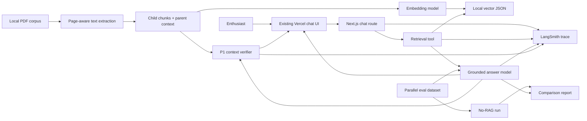

# Product Requirements Document: Grounded Egypt

| Field    | Value                                            |
| :------- | :----------------------------------------------- |
| Product  | Grounded Egypt — Citation-Verified RAG Prototype |
| Author   | Philipp Comans                                   |
| Date     | July 13, 2026                                    |
| Status   | Draft for implementation                         |
| Timebox  | Two-hour interview prototype                     |
| Audience | Product and engineering interview panel          |

## Executive Summary

Grounded Egypt is a retrieval-augmented chat experience for Ancient Egypt and Nubia enthusiasts. It answers factual questions from a curated local corpus and makes the evidence inspectable through source and chunk citations. Unlike a conventional RAG demo that treats a retrieved chunk as sufficient proof, a P1 verification step checks each citation against its broader document context and labels it as supported or contradicted.

The prototype is additive to the existing Vercel AI Chatbot UI and uses its current Next.js, React, TypeScript, and AI SDK stack. The hard two-hour scope is a working grounded answer flow, citation cards, LangSmith observability, and a small evaluation suite comparing RAG against the same agent without retrieval. The citation verifier is a core P1 requirement. Exact supporting quotes with expandable context are the first stretch goal.

## 01 — Background

### Problem Statement

Ancient-history enthusiasts can ask a general-purpose model factual questions, but a fluent answer does not show whether the claim is supported by the available books. Conventional RAG improves grounding, yet a citation may still be misleading: a retrieved chunk can omit surrounding qualifiers, represent only one side of a dispute, or fail to support the answer attributed to it.

The prototype addresses two linked trust gaps:

* **Answer grounding:** Is the response derived from the supplied Egypt and Nubia corpus rather than unsupported model memory?

* **Citation validity:** Does the cited chunk support the answer when read in its broader document context?

The local corpus contains 10 in-scope PDFs totaling 3,268 pages and approximately 1.36 GiB, excluding two files under `_to_delete`. A preflight extraction of the first 10 pages found usable text in seven PDFs and no extractable text in three, suggesting that those three require OCR. This creates a concrete prototype constraint: the ingestion path must be fault-tolerant and able to operate on a frozen, text-extractable subset rather than depending on the entire corpus.

### Market Opportunity

General-purpose answer engines demonstrate demand for answers accompanied by sources, but linked sources alone do not prove that a citation supports the associated claim. Grounded Egypt explores a narrower differentiator: visible, document-context validation for each citation.

This is an interview prototype, so market sizing and commercial validation are out of scope. The immediate opportunity is demonstrated through retrieval quality, measurable lift over a no-RAG baseline, and interviewer feedback on whether the evidence feels trustworthy and inspectable.

### Competitive and Alternative Approaches

* **General chat models:** Fast and convenient, but may answer from world knowledge without inspectable evidence.

* **Search answer engines:** Commonly display linked citations and excerpts, but do not always expose whether the cited passage supports the specific claim.

* **Basic RAG chatbots:** Retrieve chunks and attach them to an answer, but often equate retrieval relevance with factual support.

* **Grounded Egypt:** Adds a second, explicit check against surrounding document context and displays a plain-language verdict without an artificial confidence percentage.

### Primary User Persona

**The curious Ancient Egypt enthusiast**

* Enjoys learning about Ancient Egypt and Nubia but is not necessarily an academic specialist.

* Asks factual, natural-language questions and wants concise answers.

* Wants to inspect the source passage before trusting or sharing a claim.

* Currently relies on web search, encyclopedias, documentaries, and general-purpose chat assistants.

* Values accessible explanations but does not want scholarly nuance hidden by a confident answer.

### Vision Statement

Make specialist historical sources approachable without asking readers to trade convenience for verifiability: every factual answer should lead back to inspectable evidence, and every citation should survive a broader-context check.

### Product Origin

The concept emerged during an Applied AI Engineer interview planning session. Two candidate projects were considered: a self-improving chat-to-evals loop and a grounded RAG agent. Grounded RAG was selected because it combines a familiar interaction with a less obvious technical problem: bridging chunk-level retrieval to document-level evidence. The interviewers emphasized proof of correctness, a focused demo, and disciplined scope over infrastructure choices.

## 02 — Objectives

### SMART Goals

Within the two-hour implementation window, the prototype will:

1. Freeze a shared manifest of text-extractable source documents within 15 minutes so the retrieval and evaluation workstreams target the same corpus.
2. Ingest and index enough of that manifest to answer at least one non-obvious factual question from the corpus with a resolvable source chunk.
3. Render the answer and its citation cards additively within the existing Vercel chat UI.
4. Run a small, fixed evaluation suite against both the RAG system and an otherwise equivalent no-RAG baseline.
5. Target a P1 verifier that evaluates all cited chunks together with their surrounding contexts and returns a verdict for each citation.
6. Preserve five minutes at the end for a repeatable local demo and a concise explanation of cuts and tradeoffs.

### Key Performance Indicators

The evaluation suite is a required core workstream, not a stretch goal. Dataset generation is owned in parallel by a separate agent; this implementation owns the data contract, harness, integration, and results.

| Metric                   |                           Prototype target | Measurement                                                                                                                                           |
| :----------------------- | -----------------------------------------: | :---------------------------------------------------------------------------------------------------------------------------------------------------- |
| Eval suite size          |          At least 10 non-obvious questions | Count valid dataset rows after manifest validation                                                                                                    |
| Retrieval recall\@5      |                               At least 80% | Expected source chunk or page appears in the top five results                                                                                         |
| Citation resolvability   |                                       100% | Every displayed citation maps to an indexed document, chunk, and page range                                                                           |
| Citation source accuracy |                               At least 80% | Returned citations include the expected source for answerable cases                                                                                   |
| RAG answer-quality lift  | At least +20 percentage points over no-RAG | Same questions and answer model; binary LLM-judge grading against reference answers, one pinned judge model and fixed rubric prompt for both variants |
| Grounding behavior       |                                       100% | Every factual answer has at least one citation, otherwise the agent abstains                                                                          |
| LangSmith trace coverage |         100% of demo queries and eval runs | Root trace contains retrieval, answer, and applicable verification child runs                                                                         |
| Final answer latency     |          Target 15 seconds or less locally | Wall-clock timing from submit to completed answer                                                                                                     |
| P1 verification latency  |       Target 10 additional seconds or less | Wall-clock timing from answer completion to verdict display                                                                                           |

Because the suite is intentionally small, aggregate percentages are directional rather than statistically significant. The demo must show raw per-case outcomes and failure examples, not only the summary score.

### Qualitative Objectives

* An enthusiast can understand why an answer should or should not be trusted without reading implementation details.

* Citation information is visible but does not interrupt the familiar chat flow.

* A contradicted citation is presented as a warning rather than silently removed.

* The system is transparent when evidence is missing, extraction failed, or verification is unavailable.

Qualitative feedback will be gathered from the interview panel during the demo: Can they locate the evidence, understand the verification label, and identify what the system knows versus what it inferred?

### Strategic Alignment

The prototype demonstrates applied-AI capabilities relevant to production legal and knowledge products: corpus ingestion, retrieval, structured generation, provenance, evaluation, and secondary verification. It also shows how domain experts or reviewers can assess model behavior through evidence rather than relying on opaque confidence scores.

### Risks and Mitigations

| Risk                                             | Impact                          | Mitigation or cut line                                                                                      |
| :----------------------------------------------- | :------------------------------ | :---------------------------------------------------------------------------------------------------------- |
| Large or image-only PDFs block ingestion         | No usable index                 | Freeze a text-extractable subset at T+15; log and skip OCR-required files; do not perform OCR in P0         |
| Eval cases reference unindexed sources           | Misleading failures             | Share the frozen manifest with the eval agent and reject rows outside it                                    |
| Embedding the full corpus exceeds the timebox    | Core flow arrives late          | Cap documents/pages for the demo and precompute embeddings offline; preserve pipeline generality            |
| The model invents citation identifiers           | Trust failure                   | Supply valid IDs in context, require structured citation output, and validate IDs before rendering          |
| A retrieved chunk is relevant but not supportive | Misleading citation             | P1 verifier reads the cited chunks together with their parent contexts                                      |
| Verification delays the answer                   | Poor experience                 | Stream the grounded answer first; run one batched verification call afterward                               |
| Tracing captures excessive book content          | Copyright/privacy risk          | Record IDs, timings, scores, and short excerpts only; redact or suppress full parent contexts in LangSmith  |
| LLM-based grading masks errors                   | Unreliable eval                 | Prioritize deterministic retrieval/source metrics and show raw cases; use a fixed answer rubric             |
| UI work consumes the timebox                     | Missing evidence of correctness | Keep UI additive and minimal; reuse existing components and prioritize eval integration                     |
| Source material is committed or exposed          | Copyright/privacy risk          | Keep PDFs, extracted text, and embeddings local and git-ignored; send only necessary excerpts to model APIs |

## 03 — Features

### Core Features and Prioritization

Priority maps to the two-hour execution order: P0 is the hard demo gate, P1 is a core target after P0 is stable, and P2 is optional stretch.

| Priority | Feature                              | Requirement and acceptance criteria                                                                                                                                                                           |
| :------- | :----------------------------------- | :------------------------------------------------------------------------------------------------------------------------------------------------------------------------------------------------------------ |
| P0       | Corpus manifest and extraction       | Discover PDFs outside `_to_delete`; freeze an extractable subset; preserve document title, page range, and stable IDs; skip failures without aborting the run                                                 |
| P0       | Parent-child chunking                | Create retrieval-sized child chunks plus a larger surrounding context or adjacent-chunk pointer for later verification                                                                                        |
| P0       | Embedding and retrieval              | Precompute embeddings; retrieve the top five relevant chunks for a question; return stable metadata with each result                                                                                          |
| P0       | Grounded answer generation           | Answer using retrieved evidence, cite only supplied chunk IDs, and abstain when the corpus does not support an answer                                                                                         |
| P0       | Citation cards                       | Under the answer, show document title, chunk ID, page range when available, and the retrieved chunk excerpt                                                                                                   |
| P0       | Baseline comparison and eval harness | Run the parallel-generated dataset through no-RAG and RAG paths with the same answer model and record per-case plus aggregate results                                                                         |
| P0       | LangSmith observability              | Trace chat, retrieval, answer generation, eval variants, and verifier runs in a dedicated project; expose the trace ID or link for the demo                                                                   |
| P1       | Broader-context citation verifier    | In one structured model call, review the answer, all cited chunks, and each chunk's parent context; label every citation `supported` or `contradicted`, or show `verification unavailable` if the check fails |
| P1       | Verdict UI                           | Display textual status plus a supplemental icon; never rely on color or emoji alone; show an overall warning if every citation is contradicted                                                                |
| P2       | Exact quote and expandable context   | Extract the shortest supporting quote and let the user expand surrounding text without leaving chat                                                                                                           |
| P2       | Side-by-side source view             | Open the answer beside the relevant PDF page or region                                                                                                                                                        |
| P2       | Full-corpus OCR and production index | OCR image-only books and move from a local prototype index to a durable vector store                                                                                                                          |

The small eval suite is explicitly P0. It must not be deferred behind the P2 source-exploration polish.

### User Stories

* As an enthusiast, I want to ask a factual question and receive a concise answer grounded in the supplied books.

* As a skeptical reader, I want to see the document, page, chunk, and excerpt behind the answer so I can inspect it.

* As a skeptical reader, I want to know when broader context contradicts a citation so I do not mistake relevance for support.

* As a user asking an unsupported question, I want the assistant to say the corpus does not establish the answer instead of improvising.

* As a demo reviewer, I want to compare the same agent with and without retrieval on fixed cases so I can judge whether RAG adds value.

### Acceptance Tests

These scenarios are the manual test script for the prototype and map one-to-one onto the user stories. Each has an observable pass condition and requires no implementation knowledge; concrete questions come from the frozen eval suite at test time.

**AT-1 — Grounded answer (P0).** Given the app is running locally with the frozen index loaded, when the tester asks an answerable question from the eval suite, then a streamed answer appears and a Citations block renders below it with at least one card showing document title, chunk ID, page range when available, and an excerpt. Fail if no citation block appears, a card lacks its excerpt, or the answer contradicts its cited excerpt.

**AT-2 — Citation inspectability (P0).** Given AT-1 passed, when the tester reads each citation card, then every document title matches a manifest document and each excerpt is real corpus text (spot-check one against the source PDF page). Fail if any citation references a document or chunk outside the manifest.

**AT-3 — Abstention (P0).** When the tester asks a question outside the corpus (for example, a modern-events question), then the assistant states the corpus does not establish the answer and shows no citation cards. Fail if it answers confidently or fabricates a citation.

**AT-4 — Verification verdicts (P1).** Given AT-1 passed with the verifier enabled, when the answer completes, then each card shows `Verifying broader context…` and updates to explicit `Supported` or `Contradicted` text with a supplemental icon; a failed verification shows `Verification unavailable` instead of a forced verdict. Fail if a card stays pending longer than 30 seconds, shows a verdict without a text label, or displays a confidence percentage.

**AT-5 — Contradicted display (P1).** Given a contradicted citation (live, or the mocked state from the usability script), then the card shows a warning with explicit text and the citation is not silently removed; if every citation is contradicted, an overall warning appears above the cards.

**AT-6 — Eval report (P0).** Given the eval harness has run, when the tester opens the results output, then per-case rows and aggregate metrics are visible for both no-RAG and RAG variants, including at least one raw failure case.

**AT-7 — Trace inspection (P0).** Given a demo question was asked, when the tester opens the exposed LangSmith trace link, then the root trace shows retrieval and generation child runs (plus verification when run) with variant and model metadata, and no full-page book content appears in any run input or output.

**AT-8 — Keyboard and status text (P0).** When the tester navigates citation cards by keyboard, then expandable or interactive elements are reachable and every verification status is readable as text without relying on icon or color.

### Functional Requirements

#### P0: Retrieval and Grounded Answer

1. An offline command reads the frozen manifest and emits a local, reusable index.
2. Each child chunk has a stable `chunkId`, `documentId`, document title, page range, text, and a reference to broader parent context.
3. The chat route exposes a retrieval tool that accepts a normalized query and returns the top five chunks.
4. The answer prompt instructs the model to use only supplied evidence for corpus claims and to cite valid chunk IDs.
5. The server validates all returned IDs against retrieved results before streaming citation data to the client.
6. If no result clears the configured relevance threshold, the answer states that the indexed corpus does not provide enough evidence.

#### P0: Evaluation

The separate eval-data agent will deliver JSONL or JSON using this minimum contract:

```json
{
  "id": "egypt-001",
  "question": "A non-obvious factual question",
  "referenceAnswer": "The expected answer",
  "answerable": true,
  "source": {
    "documentId": "stable-document-id",
    "page": 123,
    "referenceText": "A short evidence excerpt"
  }
}
```

When `answerable` is false, `source` is omitted. The suite must include at least two unanswerable questions so abstention (the Grounding-behavior KPI and the demo abstention step) is actually exercised; all remaining cases are answerable with a known source.

The harness must:

* Validate every row against the frozen source manifest.

* Run the same question through a no-RAG baseline and the grounded RAG path.

* Keep the answer model and core generation settings constant between variants.

* Record retrieved IDs, cited IDs, answer text, answer correctness, and elapsed time.

* Print or render raw cases alongside aggregate retrieval and answer metrics.

- Grade answer correctness with a single pinned LLM judge — fixed rubric prompt, temperature 0, identical judge for both variants — and record the judge verdict and rationale per case alongside the deterministic retrieval and citation metrics.

#### P0: LangSmith Observability

1. Configure `LANGSMITH_TRACING=true`, `LANGSMITH_API_KEY`, and a dedicated `LANGSMITH_PROJECT` such as `grounded-egypt-prototype`.
2. Use the LangSmith Vercel AI SDK integration for model calls and manual `traceable` spans for retrieval and other non-model steps. Install the `langsmith` package (not yet a project dependency) and verify wrapper compatibility with the installed AI SDK 7.x as the first observability step; if the wrapper lags the SDK major version, fall back to OpenTelemetry export via `experimental_telemetry`.
3. Create one root trace per user question or eval case with child runs for `retrieval.search`, `generation.answer`, and `verification.citations` when applicable.
4. Attach filterable metadata: `variant` (`rag` or `no-rag`), `evalCaseId`, `manifestVersion`, model ID, retrieved chunk IDs, cited chunk IDs, and final verdict counts.
5. Capture latency, token usage when available, errors, and retry outcomes. Do not send full PDFs or unrestricted parent contexts to LangSmith.
6. Make a trace ID or LangSmith trace link available in the demo/debug surface so interviewers can inspect one end-to-end request.

Implementation should follow the official [LangSmith Vercel AI SDK tracing guide](https://docs.langchain.com/langsmith/trace-with-vercel-ai-sdk) and [observability quickstart](https://docs.langchain.com/langsmith/observability-quickstart).

#### P1: Citation Verification

1. After the grounded answer completes, the verifier receives the answer, all citations, and broader context for every cited chunk in one call. A batched review preserves cross-citation relationships.
2. The verifier's structured output schema is a two-value enum — `supported` or `contradicted` — keyed by `citationId`; no confidence percentage is requested or displayed. The model never returns `verification_unavailable`; the client assigns that status when the verification call fails (requirement 4).
3. `supported` means the broader context supports the answer's use of that citation. `contradicted` means the context conflicts with, materially qualifies, or fails to support that use.
4. If the verification call fails or cannot decide safely, the UI shows `Verification unavailable` rather than forcing a verdict.
5. The verifier annotates the answer but does not rewrite it in this prototype.

### Data Contracts

```ts
type SourceChunk = {
  chunkId: string;
  documentId: string;
  documentTitle: string;
  pageStart?: number;
  pageEnd?: number;
  text: string;
  parentContext: string;
};

type Citation = {
  citationId: string;
  documentId: string;
  documentTitle: string;
  chunkId: string;
  pageStart?: number;
  pageEnd?: number;
  excerpt: string;
};

type CitationVerdict = {
  citationId: string;
    // Model output is restricted to the first two values;
  // the client assigns verification_unavailable on call failure.
  status: "supported" | "contradicted" | "verification_unavailable";
  rationale: string;
};
```

### Future Enhancements

After the interview prototype, likely enhancements are claim-level inline citation highlighting, hybrid lexical/vector retrieval, reranking, OCR, section-aware chunking, PDF bounding-box links, a correction loop when citations are contradicted, a larger human-reviewed eval suite, and a durable multi-user vector index.

## 04 — User Experience

### UI Design

The design is purely additive to the existing Vercel chatbot. Chat composition, navigation, streaming text, typography, and message actions remain unchanged. A `Citations` block appears directly below a grounded assistant answer.

Illustrative state:

> **Q:** Who was the mother of King Tut?
>
> **A:** The mother of King Tutankhamun is not known with absolute certainty, but the strongest current evidence points to the mummy known as the Younger Lady. DNA evidence identified that mummy as Tut's mother, though earlier theories suggested Nefertiti or Kiya.
>
> **Citations**
>
> **Document 1 · Chunk abc · p. 42**\
> “Retrieved chunk excerpt…”\
> 👍 **Supported in broader context**
>
> **Document 2 · Chunk def · p. 107**\
> “Retrieved chunk excerpt…”\
> 👎 **Contradicted in broader context**

The example defines the visual contract, not a guaranteed eval question; final demo questions must come from the frozen corpus and eval suite.

Citation cards have four states:

* **Pending:** `Verifying broader context…`

* **Supported:** positive icon and explicit text label

* **Contradicted:** warning icon and explicit text label

* **Unavailable:** neutral warning and retry-safe explanation

P2 adds an expandable region containing the shortest supporting quote and surrounding passage.

### User Journey

1. The enthusiast enters a factual question in the existing chat composer.
2. The UI streams a normal assistant answer while the server retrieves evidence.
3. Citation cards appear under the answer with document, page, chunk, and excerpt.
4. The P1 verifier runs after answer generation and updates each card's pending state.
5. The user inspects the evidence; in P2, they expand the supporting passage.
6. For unsupported questions, the assistant clearly abstains and does not manufacture citations.

### Usability Testing

The prototype uses a scripted walkthrough rather than A/B testing:

* One non-obvious, answerable question with a known source.

* One cross-document or nuanced question with multiple retrieved chunks.

* One question outside the frozen corpus to verify abstention.

* One mocked or unit-tested contradicted state if the live run does not naturally produce one.

Success means an interviewer can identify the answer, source, excerpt, and verification state without explanation from the builder.

### Accessibility

* Use semantic headings and buttons.

* Make expandable citation content keyboard accessible.

* Include `Supported`, `Contradicted`, or `Unavailable` text; icons and color are supplemental.

* Preserve sufficient contrast using the existing design system.

* Do not attempt a full WCAG audit within two hours, but avoid introducing known keyboard or labeling regressions.

### Feedback Loops

Interview-panel feedback and eval failures are the initial feedback loop. User voting, comments, and telemetry are out of scope. After the demo, categorize failures as extraction, retrieval, generation, citation mapping, or verification errors before changing prompts or models.

## 05 — Milestones

### Development Phases

| Time                  | Phase                                         | Deliverable and exit criterion                                                                                                                                                                      |
| :-------------------- | :-------------------------------------------- | :-------------------------------------------------------------------------------------------------------------------------------------------------------------------------------------------------- |
| T+00–15 min           | Discovery and corpus freeze                   | Confirm extraction on representative PDFs; publish stable manifest and eval contract                                                                                                                |
| T+15–45 min           | Ingestion and retrieval                       | Extract selected pages/documents, chunk, embed, persist local index, and pass a direct retrieval smoke test                                                                                         |
| T+45–70 min           | Grounded chat                                 | Retrieval tool returns top five; answer emits only valid citation IDs; unsupported query abstains                                                                                                   |
| T+45–75 min           | Observability, time-sliced with grounded chat | Same implementer, time-sliced: wire env vars and the SDK wrapper first (about 5 minutes), then confirm the LangSmith root trace and retrieval/generation child runs appear in the dedicated project |
| T+70–90 min           | Citation UI                                   | Existing chat renders additive citation cards with pending states                                                                                                                                   |
| T+00–60 min, parallel | Eval dataset generation                       | Separate agent produces at least 10 manifest-aligned cases using the agreed contract                                                                                                                |
| T+90–105 min          | Eval integration                              | Run no-RAG versus RAG, inspect raw failures, and capture summary metrics                                                                                                                            |
| T+105–115 min         | P1 verification                               | Batched verifier returns per-citation structured verdicts and updates cards                                                                                                                         |
| T+115–120 min         | Release gate and demo setup                   | Run targeted tests, typecheck/lint if time permits, reset demo state, and prepare walkthrough                                                                                                       |

### Critical Path

```text
Corpus freeze → text extraction → child/parent chunks → embeddings/index
             → retrieval tool → answer/citation schema → citation UI → demo
```

The eval dataset is generated in parallel but depends on the T+15 manifest. The verifier depends on stable citation and parent-context contracts. If ingestion runs long, reduce documents/pages before cutting the eval harness or citation UI. P2 supporting-quote expansion is the first feature cut. P1 remains a core target but comes after all P0 gates are stable.

### Review Points

* **T+15:** Confirm manifest, extraction quality, stable IDs, and eval contract.

* **T+60:** Demonstrate retrieval for one known question; reduce corpus immediately if this fails.

* **T+75:** Open one complete LangSmith trace and confirm metadata is useful without exposing full source content.

* **T+90:** Demonstrate an answer with resolvable citation cards.

* **T+105:** Review baseline-versus-RAG results and decide whether P1 can be completed safely.

* **T+115:** Stop feature work and rehearse the demo.

### Launch Plan

Launch is a local interview demo, not a production deployment.

1. Start the existing app with its normal local development command.
2. Show the frozen corpus manifest and eval-suite size.
3. Show no-RAG versus RAG aggregate results and one raw failure/success case.
4. Ask one non-obvious question and inspect its citation card.
5. Show P1 verification states if complete.
6. Ask an unsupported question and demonstrate abstention.
7. Close with implemented scope, cuts, known risks, and the next production step.

### Post-Launch Evaluation

After the demo, preserve eval outputs and label every failure by pipeline stage. Prioritize retrieval/source failures before prompt tuning. The first product iteration should implement P2 supporting quotes with expandable context, then determine whether OCR and a durable vector store materially improve coverage.

## 06 — Technical Requirements

### Tech Stack

* **Application:** Existing Next.js 16 App Router and React 19 application.

* **Language:** TypeScript with existing strict type checking and Zod schemas.

* **Agent framework:** Vercel AI SDK 7 and the existing streaming chat route.

* **Observability:** LangSmith tracing for Vercel AI SDK calls plus manual spans for retrieval, verification, and eval orchestration.

* **Models:** Existing Vercel AI Gateway for answer generation; embeddings via `voyage/voyage-4-lite` (verified in the gateway catalog on July 13, 2026 — re-check at T+0 and prefer the newest lite retrieval-embedding model). Use the current chat model for P1 verification unless latency requires a smaller configured model.

* **PDF extraction:** Local Poppler `pdftotext` for text-bearing PDFs. OCR is out of scope.

* **Prototype index:** Precomputed local JSON containing chunks, metadata, parent context, and embeddings; in-process cosine similarity at query time.

* **UI:** Existing Tailwind and component system; one new citation-card component or typed tool/data part.

* **Testing:** Existing Playwright setup plus targeted unit tests; run `pnpm check` and `pnpm typecheck` before the demo when time allows.

The local JSON index is a deliberate timebox decision, not a production architecture recommendation. No database migration is required for the prototype.

### Chunking and Retrieval Specification

* Parse page by page so page numbers survive extraction.

* Normalize repeated headers, footers, whitespace, and obvious PDF artifacts.

* Target child chunks of approximately 800–1,000 tokens with 15–20% overlap.

* Store a parent context of roughly 2,000–3,000 tokens or the immediately adjacent chunks.

* Derive stable IDs from document identity, page range, and chunk ordinal.

* Retrieve top five by cosine similarity; keep a configurable minimum relevance threshold.

* Do not parse PDFs or generate document embeddings in the request path.

### System Architecture



### Application Integration

* Add a retrieval tool to the active tools in the current chat route.

* Wrap supported AI SDK calls with the LangSmith Vercel integration and instrument retrieval/eval functions with `traceable` spans.

* Extend shared UI message/tool types with citation and verifier result schemas.

* Stream answer text normally; emit typed citation data once IDs are validated.

* Render citation cards directly after the associated assistant message.

* Run verification only after citation data is stable and update cards by `citationId`. Verdicts are delivered on the same response stream: the route keeps the stream open after answer text completes, runs the single batched verifier call, and emits typed verdict parts before closing (total remains under the 60-second cap). If the stream ends early, cards fall back from pending to `Verification unavailable`.

* Keep the full request under the route's existing 60-second maximum by doing all corpus preprocessing offline.

* Tag traces with the RAG variant, manifest version, model, and eval case rather than relying on unstructured logs.

### Security and Data Handling

* Do not commit source PDFs, extracted text, embeddings, generated indexes, API keys, or large eval artifacts.

* Keep credentials in the existing environment-variable mechanism.

* Keep `LANGSMITH_API_KEY` server-side and never emit it to the browser or logs.

* Send only the retrieved excerpts and required parent contexts to model providers.

* Redact or omit full parent contexts from LangSmith traces; trace stable IDs, short evidence snippets, timing, and scores instead.

* Treat the corpus as copyrighted source material; display only short excerpts needed to substantiate answers.

* Retain existing authentication and rate limiting; no auth changes are required.

* Do not log full book content or model credentials.

### Performance and Reliability

* Optimize for one local demo user; production load testing and uptime guarantees are out of scope.

* Cache the loaded index in process.

* Batch embedding generation during offline ingestion.

* Use one batched verifier call rather than one call per citation.

* On extraction failure, continue with remaining files and report the skipped source.

* On retrieval failure, return an explicit no-evidence response.

* On verifier failure, preserve the answer and citations but label verification unavailable.

### Integration Requirements

* A working Vercel AI Gateway credential and access to chat and embedding models.

* A LangSmith project and API key with `LANGSMITH_TRACING=true`.

* Local `pdftotext` availability.

* Read access to the `Egypt and Nubia GC` corpus directory.

* A T+15 frozen manifest shared with the separate eval-data agent.

* Eval JSON/JSONL delivered using the specified contract before T+90 integration.

- The `langsmith` package added as a dependency and verified against AI SDK 7.x before observability work begins.

### Non-Goals

* Production deployment, multi-user scalability, uptime work, or a durable vector database.

* OCR for the three likely image-only books.

* Guaranteed ingestion of all 3,268 pages within the timebox.

* Web search or answers beyond the supplied corpus.

* User uploads, corpus administration, or new authentication flows.

* Automatic rewriting of an answer after a contradicted citation.

* Full PDF rendering, bounding-box highlighting, or side-by-side document navigation.

* User feedback controls, analytics, prompt optimization, or autonomous self-improvement.

## Definition of Done

The prototype is demo-ready when all P0 criteria are met:

* The app starts locally and the frozen source index loads without request-time ingestion.

* At least 10 eval cases run through both no-RAG and RAG paths, with raw and aggregate results visible.

* The eval report quantifies RAG-versus-no-RAG answer-quality lift (target: +20 percentage points) and retrieval recall.

* Every demo query and eval case is inspectable in LangSmith with retrieval and generation child runs and useful metadata.

* A non-obvious corpus question produces a concise answer and at least one valid document/chunk citation.

* Every displayed citation resolves to stored metadata and an excerpt; no citation ID is invented.

* An unsupported question abstains without a fabricated source.

* Citation cards fit the existing Vercel UI and expose accessible status text.

* Core checks pass, or any skipped check and reason is disclosed in the demo.

P1 is complete when the same answer additionally receives a broader-context verdict for each citation. P2 begins only after P0 and P1 are stable; its first deliverable is an exact supporting quote with expandable surrounding context.
